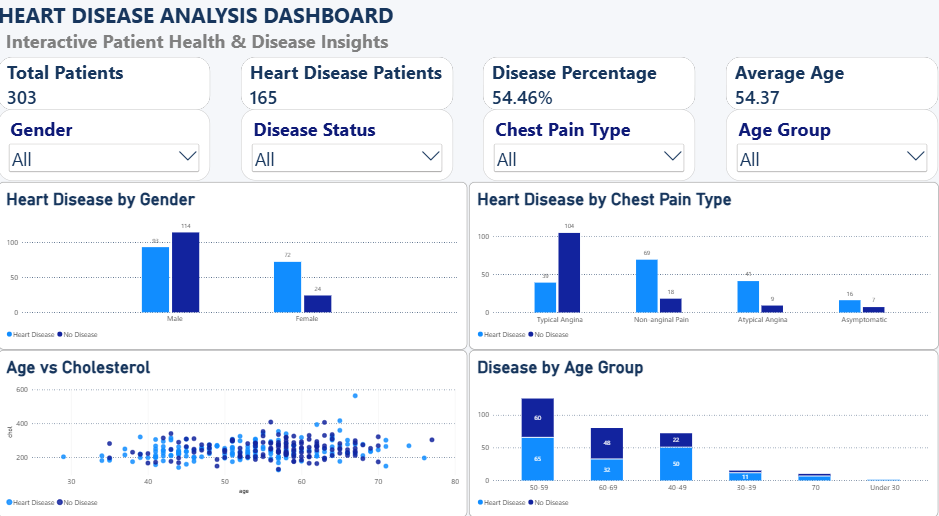

# Heart Disease Prediction and Analysis

## Project Overview

This project focuses on analyzing patient health data and predicting
the presence of heart disease using machine learning techniques.

The project combines Python-based data analysis and machine learning
with an interactive Power BI dashboard for data visualization.

## Technologies Used

- Python
- Pandas
- NumPy
- Matplotlib
- Scikit-learn
- Jupyter Notebook
- Power BI
- GitHub

## Dataset

The dataset contains patient health and cardiovascular attributes
such as:

- Age
- Sex
- Chest Pain Type
- Resting Blood Pressure
- Cholesterol
- Maximum Heart Rate
- Exercise-Induced Angina
- ST Depression
- Target

## Machine Learning Models

The following classification models were implemented:

- K-Nearest Neighbors (KNN)
- Decision Tree
- Random Forest

## Power BI Dashboard

The project includes an interactive Power BI dashboard containing:

- Total Patients
- Heart Disease Patients
- Disease Percentage
- Average Age
- Heart Disease by Gender
- Heart Disease by Chest Pain Type
- Disease by Age Group
- Age vs Cholesterol
- Interactive filters for Gender, Disease Status,
  Chest Pain Type, and Age Group

### Live Dashboard

[Open Power BI Dashboard](https://app.powerbi.com/links/83YluSQzTN?ctid=8ba02f42-a433-4ad5-bdab-0103a1bc5fa5&pbi_source=linkShare)

## Project Files

- `Heart Disease Prediction.ipynb` — Machine learning notebook
- `heart.csv` — Dataset
- `Heart Disease Prediction.pbix` — Power BI report
## Dashboard Preview

## Project Workflow

Python Dataset
→ Data Preprocessing
→ Exploratory Data Analysis
→ Feature Engineering
→ Machine Learning
→ Model Evaluation
→ Power BI Dashboard

## Author

Mondrety Trailokya Vaishnavi
